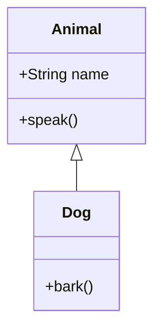
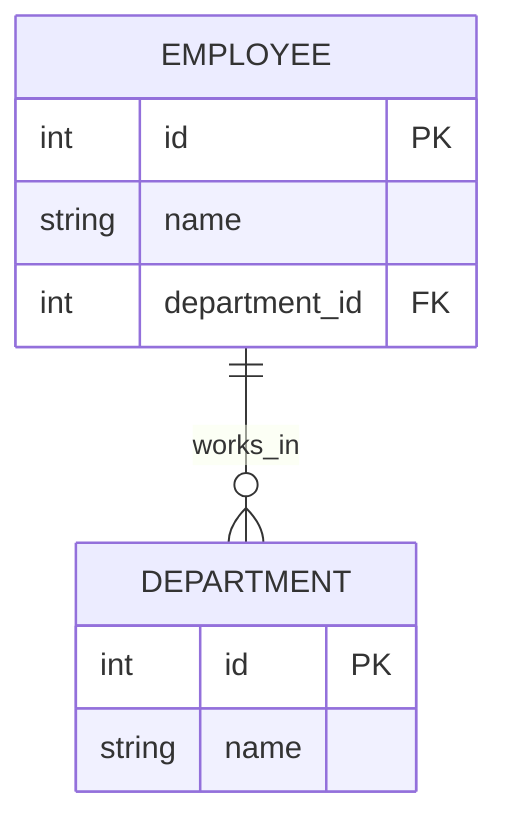

# Simple UML Diagram

```mermaid
classDiagram
  class Animal {
    +String name
    +speak()
  }
  class Dog {
    +bark()
  }
  Animal <|-- Dog
```

# Employee ER Diagram

```mermaid
erDiagram
    EMPLOYEE ||--o{ DEPARTMENT : works_in
    EMPLOYEE {
        int id PK
        string name
        int department_id FK
    }
    DEPARTMENT {
        int id PK
        string name
    }
```